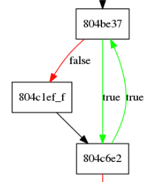

# mov (Original title: https://www.youtube.com/watch?v=cEuU64Zt4B0)

*Solved together with: [ludvigknutsmark](https://github.com/ludvigknutsmark)*<br>


Solving this challenge was very tedious but also fun. In hindsight we wish we used a bit more scripting, since we ended up doing a lot of manual work while debugging.

### Running the binary
We get a binary called mov. We thought it was pretty obvious that the binary had been compiled with the obfuscator called "movfuscator" (https://github.com/xoreaxeaxeax/movfuscator), since we had seen movfuscator before.

```
$ ./mov 
hello
hello

Nope sorry :(
$ echo "AAAAAAAAAAAAAAAAAAAAAAAAAAAAAAAAAAAAAAAAAAAAAAAAAA" | ./mov
AAAAAAAAAAAAAAAAAAAAAAAAAAAAAAAAp��
Nope sorry :(
```
It seems that our input is placed in a buffer of length 32. Let's deobfuscate it before we start reverse engineering.

### Deobfuscation
We make our life a bit easier by using Demovfuscator (https://github.com/kirschju/demovfuscator).

```
Usage: demov [-o patched] [-g graph] [-i idc]
```

**Demovfuscator doesn't remove all the MOV instructions!**

Sure, but demov is able to:

* handle hardened binaries
* reconstruct functions and their CFGs (control flow graphs)
* generate symbols for IDA
* generate a patched binary
* perform partial instruction re-substitution

-> Makes reversing moved binaries much easier
(source: https://av.tib.eu/media/32753#t=21:27,25:16)

### Static analysis (limited)
After looking at the binary in IDA for a while, we notice a bunch of 

`test eax, eax` instructions followed by

`jne 0x0804XXXX` some instructions later.

### Analysing the control flow
We build a png out of the generated `cfg.dot` file.

<a href="pics/cfg.png"></a>


Seeing this, suspect that the binary compares the input one or a few characters at a time. 

### Battle plan
A good way of seeing in which order the characters are checked is sending only unique characters. We chose the following input string:

```
ABCDEFGHIJKLMNOPQRSTUVWXYZ012345
```

We create a gdb init file setting breakpoints at EVERY ADDRESS  mentioned in the .png (42 in total), and get to work.

### Debugging

We notice our characters first being referenced shortly after the instruction `0x804be37`. Looking at our CFG, this looks like a loop:



 Our first referenced character is 'G'. Around the same place, '\_' is also referenced. These two characters are placed in `eax` and `edx` multiple times. A bit further down, as mentioned earlier, we encounter a `test eax, eax` followed by a `jne`/`jnz`. The jump leads to the `Nope sorry :(` being printed and program terminating.

So we breakpoint at a place where both 'G' and '\_' are inside registers, modify our input string accordingly and continue. We see that we make progress by modifying the referenced character and end up remapping our input string as follows:

```
ABCDEFGHIJKLMNOPQRSTUVWXYZ012345
```
->
```
ABCDEF_HIJKL_NOPQ_STU_WX_Z012345
```
Our string is starting to look like a flag!

**Moving on** after the loop, we see what looks more like if-statements instead of loop conditions. In other words, the process compares one or more characters in a basic block, and then continues to the next part of the program. 

**It gets harder** when the program starts to reference more than two strings at a time in every basic block. For example at `0x080513e7` the program seemed to check whether our 9th character (`I`) subtracted by `8` is equal to `j`. This means our character should actually be `r`.

### Solution
Stepping through the program as explained above worked fairly well. Some conditions we were unable to fulfill (this is why we should have scripted our solution!) so we ended up manually guiding the program in the right direction (`set $eip=0xcorrect`) in order to not have the program terminate. 

**Finally** we end up with the following input string:

`MBkeys_breKt_tObt_bad_:)_!012345`

We take a shot and try 

`Mykeys_arent_that_bad_:)_!` and it works!

Flag: `RITSEC{Mykeys_arent_that_bad_:)_!}`
