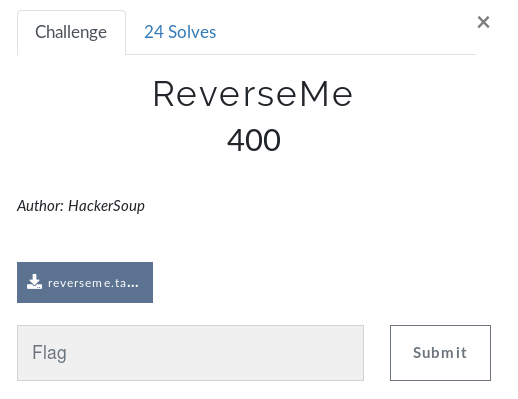
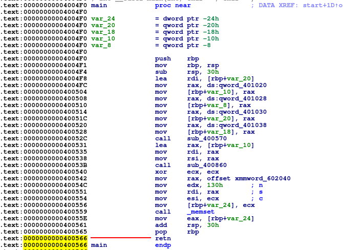
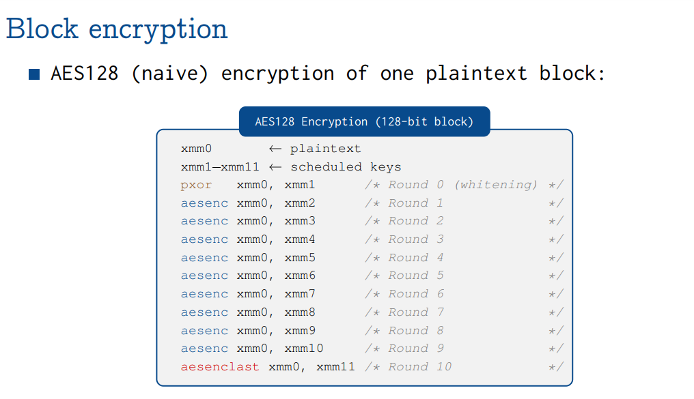

# ReverseMe 

*Co-author: [ludvigknutsmark](https://github.com/ludvigknutsmark)*



We are given a file `reverseme.tar.xz` containing: 
* A binary: `a.out` 
* and a core file: `core.6723`.

### Running the binary

```
$ ./a.out
$ ./a.out "AAAAAAAAAAAAAAAAAA"
$
```
Execution doesn't give any output, and the binary doesn't seem to use any input either.

### Static analysis

```
$ file a.out 
a.out: ELF 64-bit LSB executable, x86-64, version 1 (SYSV), dynamically linked, interpreter /lib64/ld-linux-x86-64.so.2, for GNU/Linux 3.2.0, BuildID[sha1]=c96f0993c9ecbc765db5c3f1d241ea49eff928dc, stripped
```

Checking out the core file in gdb lets us know that the core was generated while `rip` was at a breakpoint on a `ret` instruction. With IDA we could see that this was the `ret` in the main routine epilogue. 

```
$ gdb a.out core.6723
*<omitted>*
Program terminated with signal SIGTRAP, Trace/breakpoint trap.
#0  0x0000000000400566 in ?? ()
gdb-peda$ x/i $pc
=> 0x400566:	ret    
gdb-peda$ 
```



Inside `main` we see two subroutines being called. 

* The first one seems to generate round keys for AES, since it does multiple calls to `aeskeygenassist` and `aesimc` 
* The second one seems to do the actual encryption of some plaintext, since it does some xor and multiple calls to `aesenc` and finally `aesenclast`.
* After some research we see that these are parts of the hardware implementation of AES for Intel processors.


Running `strings` on the binary file we notice the string `XXXXXXXXXXXXXXXXITSTHECRYPTOKEY!`.

After some more research we find that the plaintext is usually located in the destination register of a `pxor` instruction right before the first round of the `aesenc` instruction: 
 *Source: [https://www.cosic.esat.kuleuven.be/ecrypt/AESday/slides/Use_of_the_AES_Instruction_Set.pdf](https://www.cosic.esat.kuleuven.be/ecrypt/AESday/slides/Use_of_the_AES_Instruction_Set.pdf)*

### Dynamic analysis

We find instructions similar to the image provided above, and therefore build the following hypothesis: 
* `XXXXXXXXXXXXXXXX` is the plaintext
* `ITSTHECRYPTOKEY!` is the crypto key!

```
Breakpoint 1, 0x00000000004008ba in ?? ()
gdb-peda$ x/i $pc
=> 0x4008ba:	pxor   xmm0,XMMWORD PTR [rbp-0x20]
gdb-peda$ print $xmm0
$2 = {
  <omitted>
  uint128 = 0x58585858585858585858585858585858
}
gdb-peda$ x/2x $rbp-0x20
0x7fffffffdbe0:	0x5243454854535449	0x2159454b4f545059
```
* Since we found the `XXXXXXXXXXXXXXXX` string in the destination register, we don't care if the AES mode is ECB or CBC, as that is implemented in the application layer anyway.

### Battle plan
1. Breakpoint at the same instruction as in the core file.
2. Locate the ciphertext in memory and decrypt it to confirm that our hypothesis is right. 
3. Locate the ciphertext in memory of the core dump.

While fooling around a bit, we found a strange 16-byte string located next to the `ITSTHECRYPTOKEY!` string on the stack. Luckily this turned out to be the ciphertext so we didn't have to follow the encryption through the whole program. Shown below:

```
$ gdb a.out 
<omitted>
Breakpoint 1, 0x0000000000400566 in ?? ()
gdb-peda$ find ITSTHE
Searching for 'ITSTHE' in: None ranges
Found 4 results, display max 4 items:
<omitted>
[stack] : 0x7fffffffdc20 ("ITSTHECRYPTOKEY!\355\227a\322\067\355\365*t\345ێ#\344\063\255\240\017@")
gdb-peda$ x/4gx 0x7fffffffdc20
0x7fffffffdc20:	0x5243454854535449	0x2159454b4f545059
0x7fffffffdc30:	0x2af5ed37d26197ed	0xad33e4238edbe574
```

```
>>> decrypt(key="ITSTHECRYPTOKEY!", cipher)
'XXXXXXXXXXXXXXXX'
```
Our hypothesis seems right. Now let's find out at which offset from `$rsp` we found the key and ciphertext.

```
gdb-peda$ print $rsp - 0x7fffffffdc20
$2 = (void *) 0x28
```

So the key and ciphertext ends up at `$rsp - 0x28`. Check out the same offset in the core dump:
```
$ gdb a.out core.6723
<omitted>
gdb-peda$ x/4gx $rsp - 0x28
0x7fffffffd690:	0x5959595959595959	0x5959595959595959
0x7fffffffd6a0:	0xdfd2cc3570fc29a6	0x9f4f5ec2eb42fb99
```

Both the ciphertext and the key is different! 

### Solution

After some trial and error we concluded that:

* In the binary the **plaintext** has been replaced with `XXXXXXXXXXXXXXXX` 
* In the core dump the **key** has been replaced with `YYYYYYYYYYYYYYYY` 

So the solution is found by decrypting the ciphertext from the core dump with the key found in the original binary. 

``` python
#!/usr/bin/python2
from Crypto.Cipher import AES
from binascii import unhexlify

def decrypt(key, cipher_text):
    aes = AES.new(key)
    plaintext = aes.decrypt(cipher_text[:16])
    return plaintext

cipher_text = unhexlify("a629fc7035ccd2df99fb42ebc25e4f9f")
print decrypt("ITSTHECRYPTOKEY!", cipher_text)
```

```
$ ./solution.py
RITSEC{AESISFUN}
```
