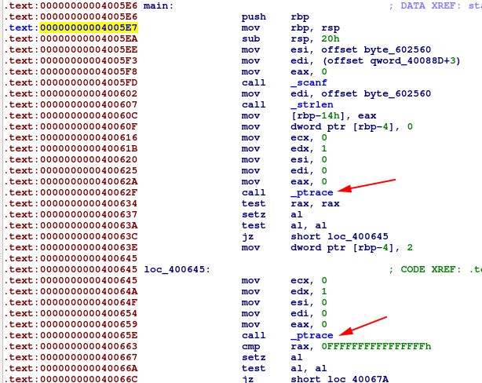
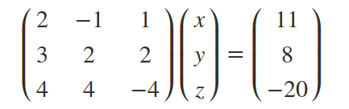

# Friedrich's Christmas Hangover 


### Summary

* XOR the first 200 bytes with 13 to repair the original elf
* Patch the anti-debug instructions
* Dynamic analysis
* Solve linear equation `Ax=b` where 
  * A is a 36*36 matrix containing scalars found in the runtime memory 
  * b is a vector with 36 sums found the same way
  * x is the flag

### Walkthrough
We are given a file `chall`.
```
$ file chall
chall: data
```

Viewing the hex dump of the file with shows that it looks like an ELF binary, but the first 200 bytes are XOR'ed with `0xd` (13).
```
$ xxd chall | head -n 14
00000000: 7248 414b 0f0c 0c0d 0d0d 0d0d 0d0d 0d0d  rHAK............
00000010: 0f0d 330d 0c0d 0d0d 0d08 4d0d 0d0d 0d0d  ..3.......M.....
00000020: 4d0d 0d0d 0d0d 0d0d 9d2b 0d0d 0d0d 0d0d  M........+......
00000030: 0d0d 0d0d 5d0d 350d 040d 4d0d 160d 170d  ....].5...M.....
00000040: 0b0d 0d0d 080d 0d0d 4d0d 0d0d 0d0d 0d0d  ........M.......
00000050: 4d0d 4d0d 0d0d 0d0d 4d0d 4d0d 0d0d 0d0d  M.M.....M.M.....
00000060: f50c 0d0d 0d0d 0d0d f50c 0d0d 0d0d 0d0d  ................
00000070: 050d 0d0d 0d0d 0d0d 0e0d 0d0d 090d 0d0d  ................
00000080: 350f 0d0d 0d0d 0d0d 350f 4d0d 0d0d 0d0d  5.......5.M.....
00000090: 350f 4d0d 0d0d 0d0d 110d 0d0d 0d0d 0d0d  5.M.............
000000a0: 110d 0d0d 0d0d 0d0d 0c0d 0d0d 0d0d 0d0d  ................
000000b0: 0c0d 0d0d 080d 0d0d 0d0d 0d0d 0d0d 0d0d  ................
000000c0: 0d0d 4d0d 0d0d 0d0d 0000 4000 0000 0000  ..M.......@.....
                           ^200th byte
000000d0: 900a 0000 0000 0000 900a 0000 0000 0000  ................
```
Let's repair the file.
```python
#!/usr/bin/python2
with open("chall","r") as fh:
    raw = fh.read()

unxored=""
for i in range(0, 200):
    print i, raw[i]
    unxored+=chr(ord(raw[i])^13)

repaired = unxored + raw[200:]

with open("repaired", "w") as fh:
    fh.write(repaired)
```

```
$ ./repair_binary.py
$ file repaired
repaired: ELF 64-bit LSB executable, x86-64, version 1 (SYSV), dynamically linked, interpreter /lib64/ld-linux-x86-64.so.2, for GNU/Linux 3.2.0, BuildID[sha1]=a1c50e899eff5475ccc18f202464ccafffc185b4, stripped
```
Sweet, we get a stripped binary.

### Running the binary

```
$ ./repaired 
asd
Friedrich thinks the length of the message is wrong.
```
The binary tells us the length of our input "asd" is wrong, how jolly! Bruteforcing the length results in `36`.
```
$ python -c 'print "A"*36' | ./repaired 
Nope, Friedrich says you're still wrong,but he feels you're getting closer!
```

However, giving the same input through gdb results in no output, and exit code `0377`, indicating the program has anti-debug tech. 

```py
gdb-peda$ r < <(python -c 'print "A"*36')
[Inferior 1 (process 19875) exited with code 0377]
gdb-peda$ 
```

### Static analysis

`ptrace` is a libc function that can be used to detect debuggers and is used here.
```
$ objdump -R repaired
0000000000601018 R_X86_64_JUMP_SLOT  strlen@GLIBC_2.2.5
0000000000601020 R_X86_64_JUMP_SLOT  ptrace@GLIBC_2.2.5
0000000000601028 R_X86_64_JUMP_SLOT  scanf@GLIBC_2.2.5
0000000000601030 R_X86_64_JUMP_SLOT  puts@GLIBC_2.2.5
```

It is called twice (haven't investigated why) in `main` after `scanf` and the `strlen` check, shown below in IDA:



### Patching

So let's use `radare2` patch those instructions away by setting `rax` to `0` always, since the calls returned `-1` when I was debugging. The opcodes for the call to `ptrace` consists of 5 bytes so let's replace it with `nop`s.

```
$ r2 -w repaired 
[0x00400500]> aaaaa
<omitted analysis output>
[0x00400500]> s 0x040062f
[0x0040062f]> "wa nop;nop;nop;nop;nop"
Written 5 byte(s) (nop;nop;nop;nop;nop) = wx 9090909090
[0x0040062f]> s 0x040065e
[0x0040065e]> "wa nop;nop;nop;nop;nop"
Written 5 byte(s) (nop;nop;nop;nop;nop) = wx 9090909090
[0x0040065e]> q
```

After this, the binary still kept jumping to an exit function because of a condition I wasn't able to reverse: 

```
   0x4006cb:	cmp    DWORD PTR [rbp-0x4],0x6
=> 0x4006cf:	je     0x4006db
gdb-peda$ x/wx $rbp-0x4
0x7fffffffdc1c:	0x00000002
```

It compares a value from a stack variable (which I couldn't figure out - another anti-debug feature?) that evaluates to `2` with the constant `6`. 

**So I patched this `je` to instead always `jmp`.**

After this, debugging seems to work properly!

```
$ gdb patched
gdb-peda$ r < <(python -c 'print "A"*36')
Nope, Friedrich says you're still wrong,but he feels you're getting closer!
[Inferior 1 (process 22868) exited normally]
```

### Dynamic analysis
From here on out I stepped through the running binary with gdb-peda, and found out that our input string is checked using the following algorithm (written in pseudo-python code):

```python
scalars = <array of 36*36 (1296) constant integers)
sums = <array of 36 constant integers>
for i in range(0, 36):
  checksum = 0
  for j in range(0, 36):
    checksum += input_string[j] * scalars[(i*36)+j]
  if checksum != sums[i]:
    print "Nope, Friedrich says you're still wrong,but he feels you're getting closer!"
    exit()
print "Yes,that's the message Friedrich forgot last night!"
```

Around this time I realized "Friedrich" is a reference to Carl Friedrich Gauss (I googled "Friedrich math"!) -  this is a linear equation that can be solved using **Gaussian Elimination**.

### Math

Here are the 36 sums, retrieved from the runtime memory:
```
0x601060:	0x000606eb	0x0006dcb8	0x0005ac28	0x00062b72
0x601070:	0x00060332	0x0008589f	0x00075f44	0x0005abc9
0x601080:	0x0005eb6b	0x0004ce54	0x0006e0db	0x0005fb34
0x601090:	0x000573a5	0x000621f7	0x0005d0bd	0x0004c56b
0x6010a0:	0x0006ae76	0x00062309	0x0006a537	0x00060389
0x6010b0:	0x000612d0	0x00050a71	0x0006ae39	0x0005d651
0x6010c0:	0x0005b857	0x0004e896	0x0007a2eb	0x000641c1
0x6010d0:	0x0005845e	0x0006c126	0x00066950	0x0006e5d5
0x6010e0:	0x0004e957	0x0006379d	0x00060298	0x000633a4
```

And some of the 1296 scalars:
```
0x601100:	0x00000071	0x00000009	0x0000003e	0x000000ff
0x601110:	0x000000a8	0x0000008b	0x000000c1	0x0000000f
0x601120:	0x0000007e	0x00000011	0x00000070	0x000000ae
...
0x602510:	0x00000047	0x000000c8	0x00000086	0x000000fb
0x602520:	0x000000cf	0x0000002f	0x00000073	0x0000002f
0x602530:	0x000000a7	0x00000051	0x00000053	0x00000018

```

Basically, we need solve this equation Ax=b:



Where `A` is a square matrix of our 1296 scalars and `b` is a vector with our 36 sums. `x` is then a vector with the ascii values of the flag!

### Solution

I used `octave` (file: `gauss_it.m`) to solve the equation and parsed the resulting values with python (file: `decode_flag.py`).

```sh
X-MAS{G4u5s_w4s_n1c3_th1s_Chri5tma5}
```